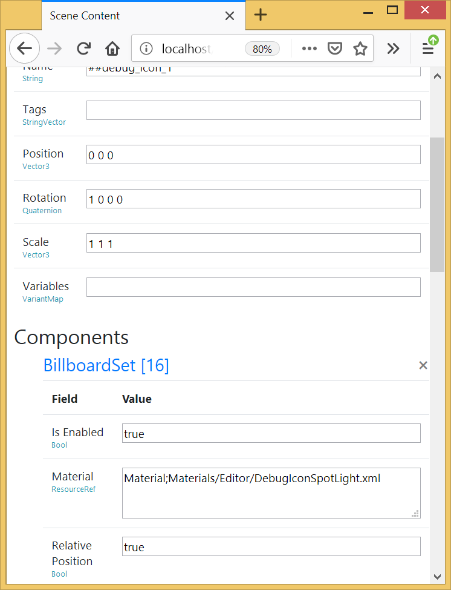
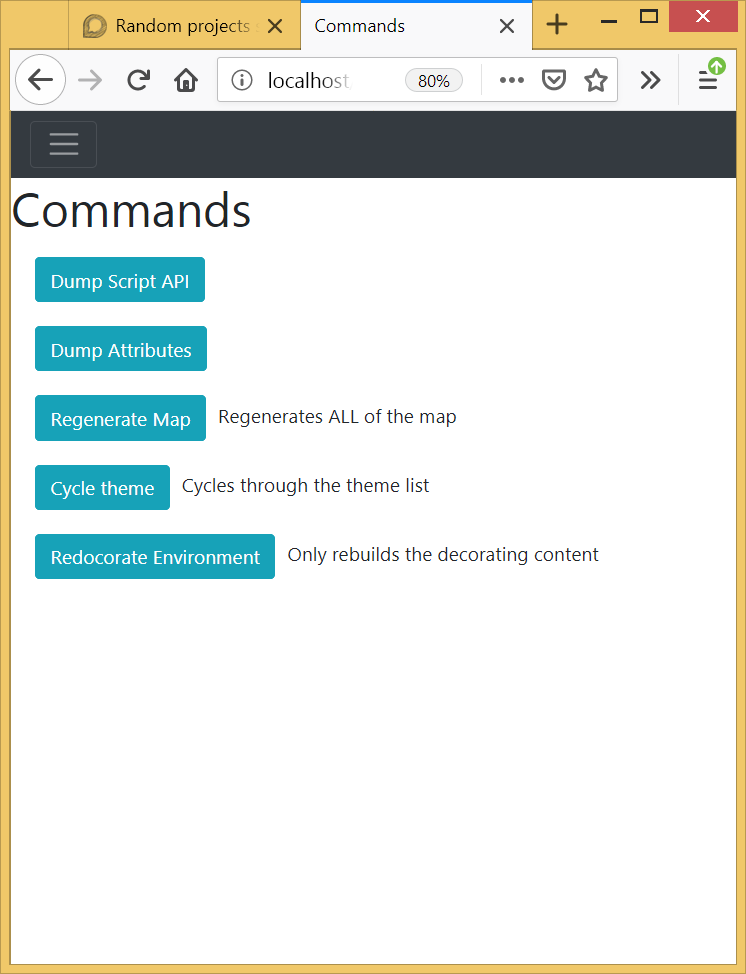

# Urho Embedded Diagnostic
Embedded diagnostics server for Urho3D. Defaults to port 80 and can be accessed with `localhost`.

It is not designed to be a substitution for an editor or other tools, but an additional swiss army knife to fulfill multiple duties at runtime without requiring setting up additional GUI. Paired with the script-console it should provide enough for most basic tweaks and understanding what/why things are happening in your project.

Depending on local network and firewall settings you can also access the diagnostics from your phone while the game remains running, negating any need to run in windowed mode or gamble with alt-tab driver  hell.

Currently none of CivetWeb's security features are used, and I cannot see how they could be secure when the executable is shipped (short of deferring authentication to a master server somehwere) so it assumed that the DevServer will only be enabled in internal builds and not release builds.

I would not recommend leaving the server live in a public build.

---

To activate:

```C++
    DevServer::RegisterObject(context_);
    context_->RegisterSubsystem<DevServer>();
```

---

Publish a text or image dump:

```c++
    img->SetSize(64, 64, 3);
	img->Clear(Color::MAGENTA);
	context_->GetSubsystem<DevServer>()->Publish("ImageTest", img);
	context_->GetSubsystem<DevServer>()->Publish("Text", "Here's some simple text!");
```

Text and image dumps are particularly useful when you want to emit information about the result of an operation that is not easily walked through in the debugger or logs, such as a trace through a collection of procedural generation routines.

---

Register a scene for inspection:

`GetContext()->GetSubsystem<DevServer>()->AddScene(scene_);`

Register a lambda command:

```c++
context_->GetSubsystem<DevServer>()->RegisterCommand("Regenerate Map", "Regenerates ALL of the map", [](Context* ctx) {
		URHO3D_LOGINFO("Command executed");
	});
```





## TODO

- Consistently handle spaces in URIs
  - Currently some of the code assumes browser will still make requests on URIs with spaces
  - Could not find anything in the specs that actually forbids spaces, from what I read all indication is that spaces were just *assumed* to not be used without a formal forbiddance of them
    - Could have missed something though, better to change everything to assume they are forbidden
- Not all attributes in the inspector can currently be edited
  - It is debatable how many attribute types *should* be editable given the *micro* focus of the utility
- Data handlers for resources
  - Texture2D
  - XMLFile
  - JSONFile
- Script console
- Render-target support as image dumps
